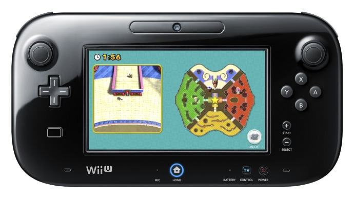
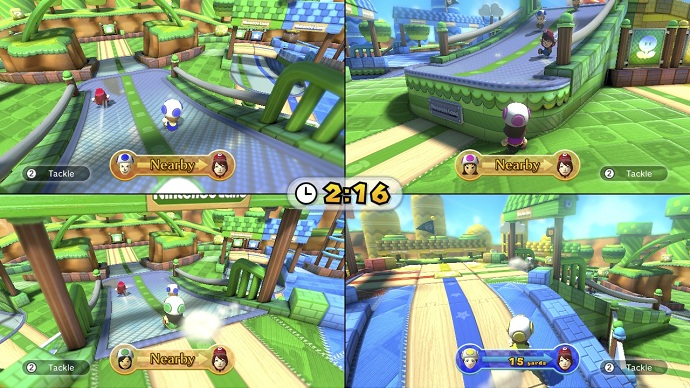
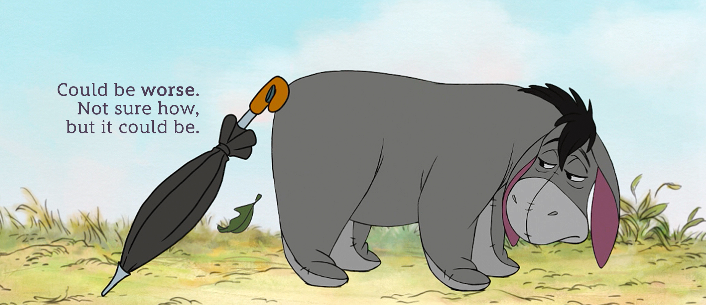
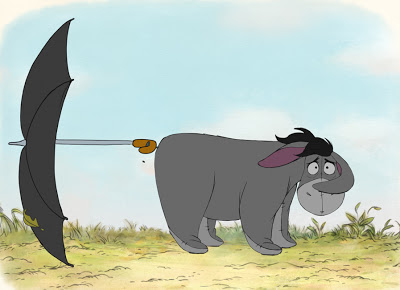
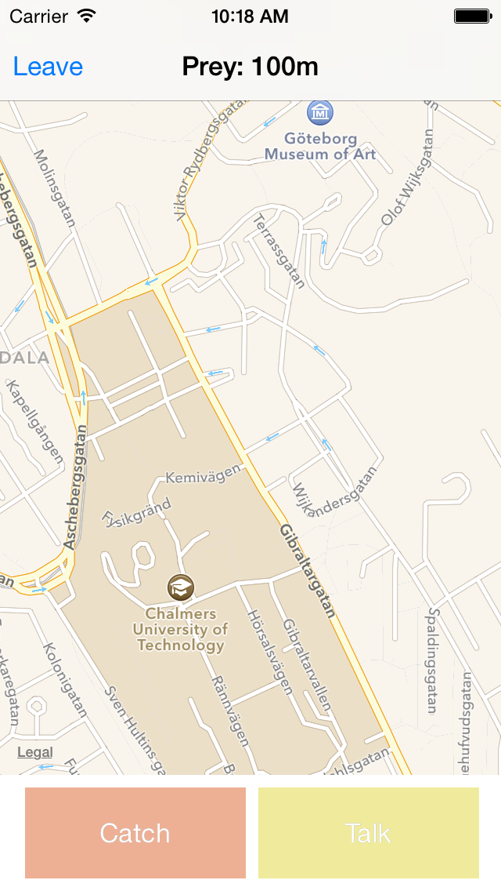
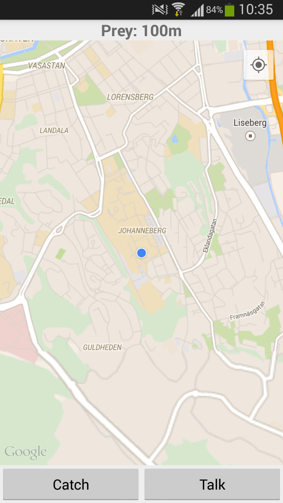

# [fit] The Pursuit
## Next genegration of hide and seek

^ Presenter oss

---

# Nintendo Land: Mario Chase

^ Beskriva spelet

---

# The Pursuit is

- Augmented reality
- Mobile
- Multiplayer

^ förklara vad spelet är

---

# [fit] Problems?

- How should the devices communicate?
- What are resonable rules for the game?
- What is good interface desing?
- How much can we affect the battery and data traffic?
- And so on...

---

# [fit] Bulding 
# [fit] the 
# [fit] server

^ lösning på komunikation mellan enheter

---

# [fit] Google 
# [fit] App Enige

^ Lätt bra enligt googles egna ord jämnför med de andra alternativen. Amazon, Parse, Azure osv

---

^ Verkar genomförbart men lite bökigt.

---

^ Insåg att det var fragmenterat och dålig dokumentation

---

# [fit] Parse

^ Testa något annat och hoppas på det bästa

---

^ Störe begränsingar men enlare att få något gjort. Bra dokumentation

---

^ Att struktuera spelets state

---

# [fit] Cloud 
# [fit] code

^ manipulera spelets state 

---

# [fit] Building 
# [fit] the 
# [fit] applications

^ cross-plattform

---

^ Hur applikationen fungerar

---

^ Hur man spelar spelet

---

